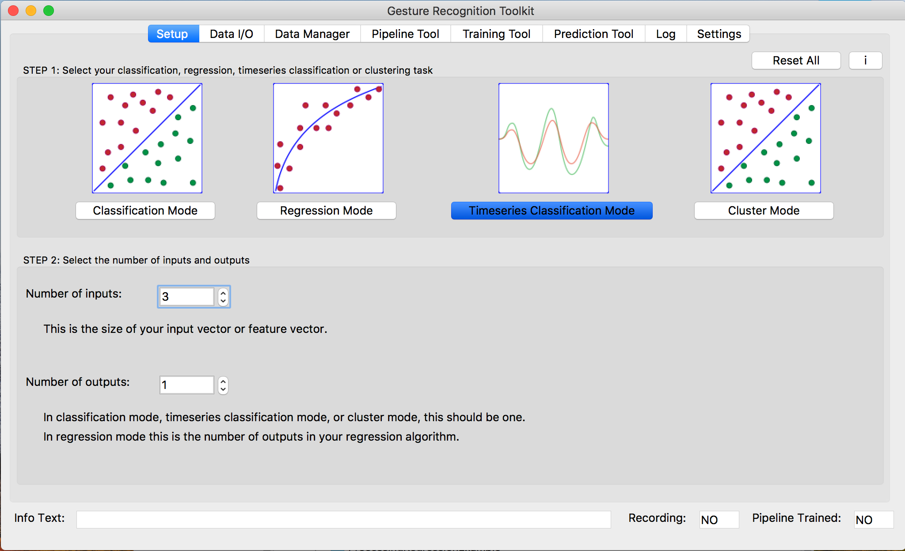

# Badminton Shot Classifier
Real-time recogniton and classification of various types of shots made in Badminton. 

## How to use
### Connecting to the device

Go to computer settings and turn on bluetooth connectivity. A few seconds after the device is powered on it will show as a bluetooth device. Since we are using serial bluetooth the device will appear as a serial device connected to COMX on windows or /dev/cu.RNBT-7BD8-RNI-SPP on Mac.

### Creating dataset

First we need to collect linear acceleration data from the IMU to create a dataset. We can do this manually with any data capturing software but here we show how ro do it with the Gesture Recognition Toolkit UI and Processing.
Follow these steps to download and install the necessary tools.
http://www.nickgillian.com/wiki/pmwiki.php/GRT/GUIProcessing.

Open GRT UI and adjust setup settings to match the following:

1. Timeseries Classification Mode
2. Number of inputs 3 (x,y and z linear acceleration axis). 
3. Number of outputs 1 (predicted label).

Open and run the ProcessingIMUBluetooth script using Processing from the ProcessingIMUBluetooth directory.

This script listens for incoming serial data coming from the device, formats the data and send it to the GRT UI using OSC protocol to start recording samples. To record a new sample go to the data manager tab and press record, press the button again to stop recording. Once the recording session is fisnished we have to save all the samples to a file, to do it just name the dataset and press save it with a .grt extension.
